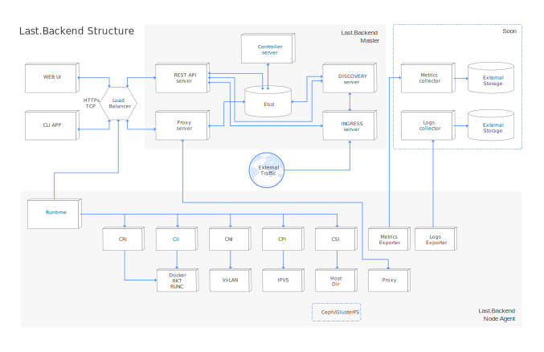

== Getting Started

=== Ready to go environment

Ready-to-go environment will be soon available on cloud.lastbackend.com[cloud.lastbackend.com] control panel for your experiments.
In our control plane you can create new cluster, or connect existing cluster.

There are several types of management for cluster connected to clontrol panel:
- WEB UI
- CLI

Using this panel you can manage multiple clusters located on defferent hosting providers from single point.

=== Provision personal cluster

There are many options how you can get local last.backend cluster. The most popular are described here:

- local version with docker-machine
You can easilly create local environment with docker-machine. You can create local cluster contains 1 node or multiple nodes, with full fuctional support.
This is a good point to start testing, or start contributing.

- hosted version, provisioned with ansible
Our team prepared ansible roles for deploy last.backend cluster on your favourite environment. Ansible roles located at separated repository lastbackend/ansible[https://github.com/lastbackend/ansible]

=== Development environment

==== Prerequisites

- Go 1.7 or higher
- Go docker client v17.03
- Go etcd client for v3
- Git

For creating local development environment we suggest you to use docker-machine provision type:
include::installation/development.adoc[]
