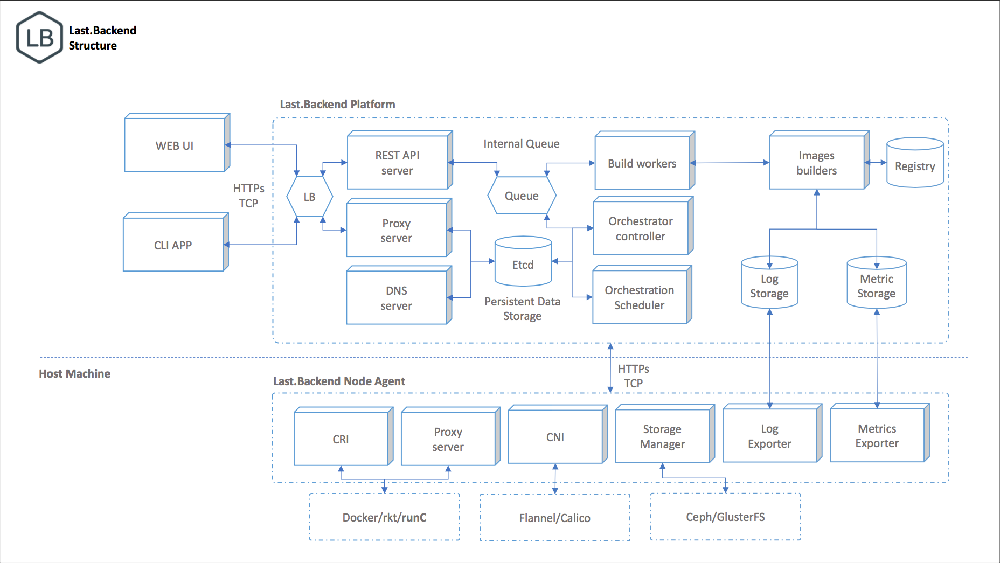

== Getting Started

=== Build

==== Prerequisites

- Go 1.7 or higher
- Go docker client v17.03
- Go etcd client for v3
- Git

[source,bash]
----
$ go get github.com/lastbackend/lastbackend
$ cd ${GOPATH:-~/go}/src/github.com/lastbackend/lastbackend
$ make deps && make build && make install
----

=== Create local development environment

use docker-machine to create nodes for cluster

[source,bash]
----
# set sources path
export LB_SOURCES_PATH=`/opt/src/github.com/lastbackend/lastbackend`
cd ${LB_SOURCES_PATH}
make deps

# create master node
docker-machine create --driver virtualbox master

# note: for virtulabox driver we can mount host dir into docker-machine with this command
VBoxManage sharedfolder add master --name /lastbackend --hostpath $LB_SOURCES_PATH --automount

# create minion nodes
docker-machine create --driver virtualbox minion-00
VBoxManage sharedfolder add minion-00 --name /lastbackend --hostpath $LB_SOURCES_PATH --automount

docker-machine create --driver virtualbox minion-01
VBoxManage sharedfolder add minion-01 --name /lastbackend --hostpath $LB_SOURCES_PATH --automount

# run etcd on master machine
export MASTER_IP=$(docker-machine ip master)
docker run -d -p 4001:4001 -p 2380:2380 -p 2379:2379 \
 --name etcd quay.io/coreos/etcd:v2.3.8 \
 -name etcd0 \
 -advertise-client-urls http://${MASTER_IP}:2379,http://${MASTER_IP}:4001 \
 -listen-client-urls http://0.0.0.0:2379,http://0.0.0.0:4001 \
 -initial-advertise-peer-urls http://${MASTER_IP}:2380 \
 -listen-peer-urls http://0.0.0.0:2380 \
 -initial-cluster-token etcd-cluster-1 \
 -initial-cluster etcd0=http://${MASTER_IP}:2380 \
 -initial-cluster-state new

# fetch deps
docker run --rm -it  \
      -v /lastbackend:/go/src/github.com/lastbackend/lastbackend \
      -w /go/src/github.com/lastbackend/lastbackend \
      --name=deps \
      --net=host \
      golang ./hack/bootstrap.sh

# run Last.Backend Cluster API from sources in docker
docker run -d -it --restart=always \
      -v /lastbackend:/go/src/github.com/lastbackend/lastbackend \
      -v /lastbackend/contrib/config.yml:/etc/lastbackend/config.yml \
      -w /go/src/github.com/lastbackend/lastbackend \
      --name=api \
      --net=host \
      golang go run ./cmd/kit/kit.go api -c /etc/lastbackend/config.yml
----

=== Use

==== Daemon
[source,bash]
----
$ lbd
----

==== Command line client
[source,bash]
----
$ lbc --help
----
