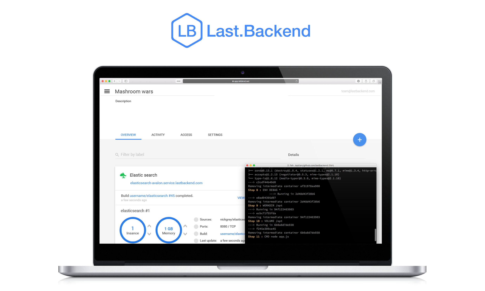

= Last.Backend. Reference Guide
:revdate: {docdate}
:toc: left
:toclevels: 3
:sectnums:
:sectanchors:
:Author: Alexander Kaloshin, Konstantin Pastor
:revnumber: latest
:icons: font
:source-highlighter: coderay

This reference for version: _{revnumber}_

*Last.Backend: the apps cloud hosting for fast apps deploying, you don't need to manage*

Source code available at https://github.com/lastbackend/lastbackend[lastbackend/lastbackend] GitHub repository.

[TIP]
====
If you have any questions about the *Last.Backend* usage or want to share some information with the *Last.Backend* community, please go to one of the following places:

* mailto:question@lastbackend.com[question@lastbackend.com]
* https://twitter.com/LastBackend[twitter @ LastBackend]
* https://www.facebook.com/lastbackend[facebook]

====

include::getting-started.adoc[]
include::cli.adoc[]
include::api.adoc[]
include::contributing.adoc[]

[appendix]
== License

This project is licensed using the  *Apache License Version 2.0*.
For the full project license, see the https://github.com/lastbackend/lastbackend/blob/master/LICENSE[LICENSE] file.
